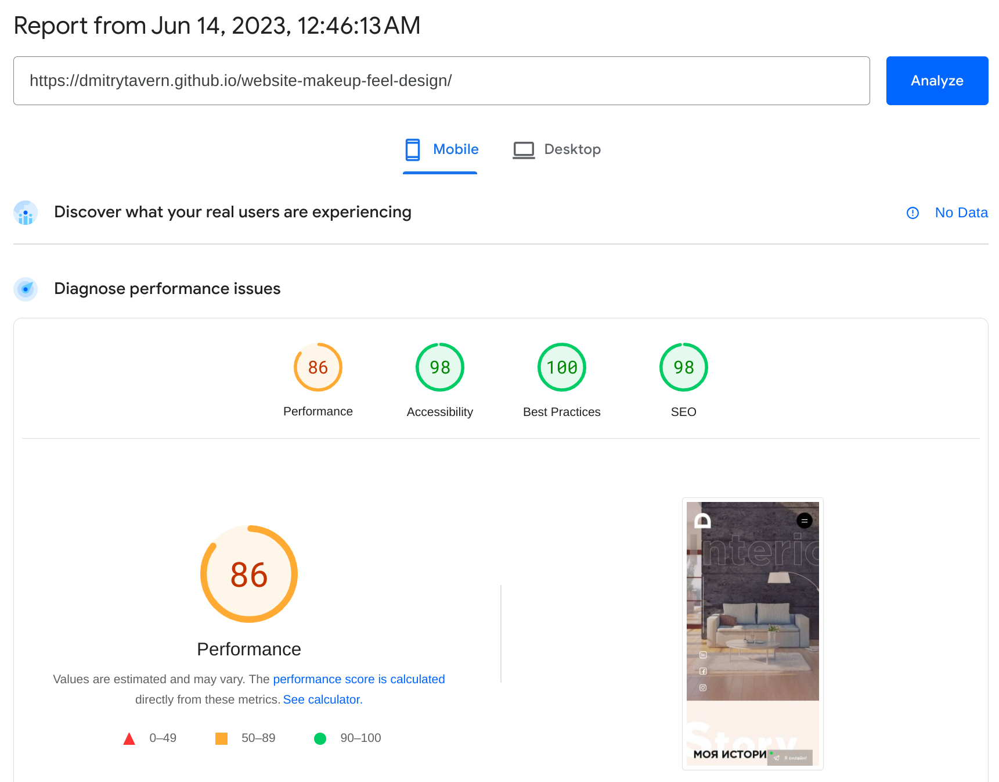
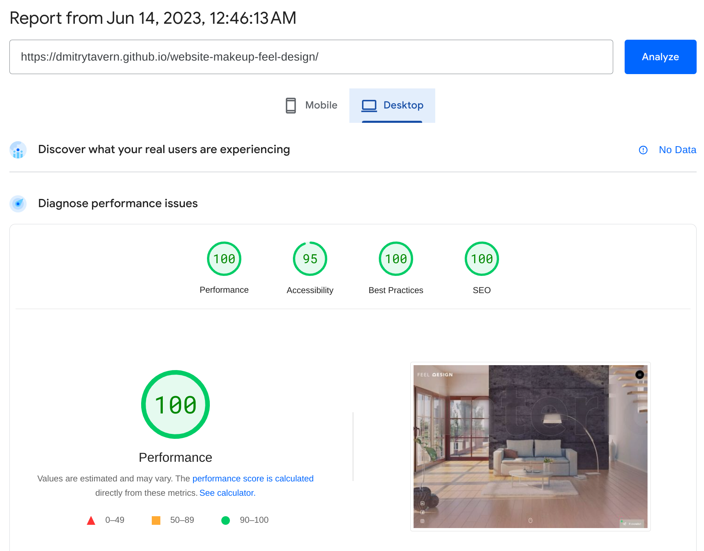
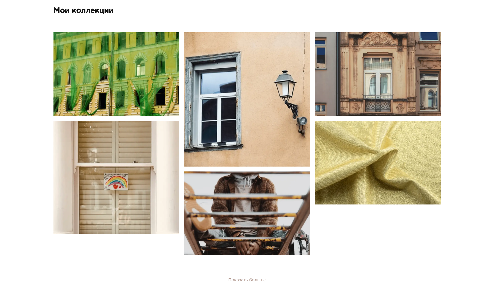

# Feel Design

The **Feel Design** is a business card site for an interior designer, representing his creative personality and professional skills. The site was created to impress and inspire visitors with his unique style and approach to interior design. See [**demo**](https://dmitrytavern.github.io/website-makeup-feel-design/).

**Developers:**

- [Dmitry Tavern (developer)](https://github.com/dmitrytavern).
- [Lyovushkin Kyrylo (designer)](https://www.instagram.com/k.lyovushkin/).

**Screenshot:**


## Formulation of the problem

Create a cross-browser, adaptive website by design in Sketch. Key points for adaptability: **375px**, **768px**, **1100px**, **1600px**. There are no additional requirements.

Pages to create:

- [Home](https://dmitrytavern.github.io/website-makeup-feel-design/)
- [Cases](https://dmitrytavern.github.io/website-makeup-feel-design/cases.html)
- [Services](https://dmitrytavern.github.io/website-makeup-feel-design/services.html)
- [Contacts](https://dmitrytavern.github.io/website-makeup-feel-design/contacts.html)
- [Case inner](https://dmitrytavern.github.io/website-makeup-feel-design/case.html)
- [Service inner](https://dmitrytavern.github.io/website-makeup-feel-design/service-decor.html)

## Technologies

&nbsp;
&nbsp;
&nbsp;
&nbsp;
&nbsp;
&nbsp;
&nbsp;
&nbsp;
&nbsp;
&nbsp;
&nbsp;
&nbsp;
&nbsp;
&nbsp;
&nbsp;
&nbsp;

Also used: Macy.js, autosize.js

## Performance

The site is a little underperforming on phones, while on desktops everything is fine. However, it is worth bearing in mind that this is after optimization.

&nbsp;
&nbsp;

## Problems

### 01. Implementation of a dynamic column gallery

On the [service inner page](https://dmitrytavern.github.io/website-makeup-feel-design/service-decor.html), needed to make a column-based gallery that was very similar to the one used on Pinterest, while repeating the design with precision and detail.

**Solution:** I've been trying to get the grid effect through css for a long time. And there were even successful attempts with Grid Grid. But all these ways had problems (which I don't remember anymore). So it was decided to use Macy.js to create such a grid system.



### 02. Implement dynamic content changes

On the [main page](https://dmitrytavern.github.io/website-makeup-feel-design/) there is a slider, which is divided into a picture and a block of information. It was necessary to make the block fixed, so that it does not move when you swipe.

**Solution:** I used Swiper.js for the slider, so I attached a listener to change the slide and every time the slide changed, I drew information from data-\* attributes of the active slide.


## Conclusions

As I am writing this text long after the end of the project, I have come to the following conclusions:

- **Lots of js.** Libraries were used, which could have been changed to a self-written analogue or found a more suitable analogue. Such a script as bootstrap.min.js could not be used at all. jQuery was also obsolete and native js could have been used.

- **Splitting js.** All the code is presented in one file, which is wrong. It turns out that the code for the cases page can be run on the main page, which in theory, will lead to errors. It would be more correct to split the js into strings.

- **Duplicate styles.** If you look closely, the styles of each page are very similar and have some small differences. I think now, you could more intelligently split the design into components.

- **Spent time.** The layout of this project took as much as **53 hours**, which is just a **terrible amount of time**. There is an explanation for this - it was problematic to execute the design accurately. Especially the intro on the main page, there were problems with the text. Adding the paralax effect, non-standard look of the inside page of the case, pixel perfeсt in relation to the text on the pages of services. But all the same, a lot of time was spent and I would have made it much faster now.

## Guide

If you only need a finished build, you can download it from the [latest release](https://github.com/dmitrytavern/website-makeup-feel-design/releases/latest/download/website-makeup.tar.gz).

This project is obsolete and uses an older version of **Node.js** - **v16.20.0**. There may be errors on newer versions. Make sure you are using this version of Node.js.

There may also be problems running on **Windows** or **MacOs** because the webpack config may not be ready due to different implementation paths.

Steps to manually build a project:

1. Clone a repository:

```
git clone https://github.com/dmitrytavern/website-makeup-feel-design.git
```

2. Install dependencies:

```
npm ci
```

3. Run a command:

```
npm run dev
npm run build
npm run build:serve
```

- **npm run dev** - launches a live-reload webpack dev server for development.
- **npm run build** - builds the entire project in a production version.
- **npm run build:serve** - runs the production server to test the finished build.

## License

MIT - check repo files

Copyright (c) 2020-present, Dmitry Tavern
